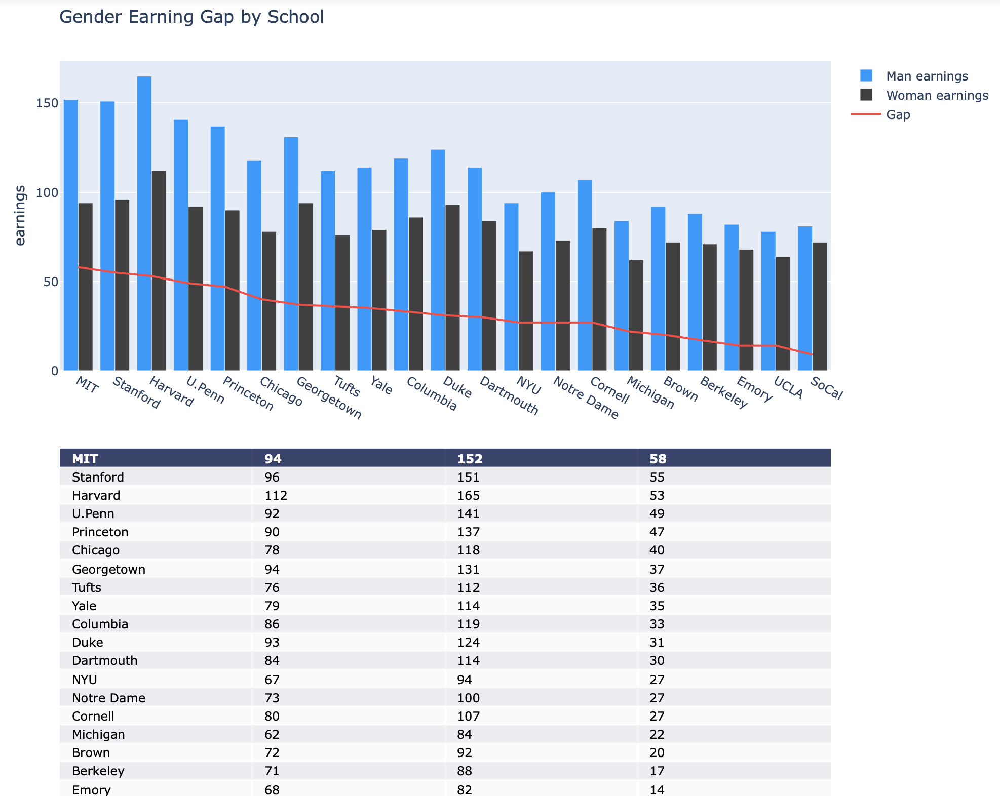

# 201502119 정지원 lab05 보고서

### 데이터 전처리

pandas의 read_csv를 이용하여 파일을 불러온다.

```python
df = pd.read_csv(url)
# 아래처럼 사용할 수 있다
df.Men
df['Men']
# 값만 list 형태로 가져오기 위해서는 values를 사용한다
df.values
```


### Goal1 : 그래프 그리기

plotly를 이용하여 그래프를 그린다.

```python
fig = ff.create_table(df.values, height_constant=40)

MenBar = go.Bar(x=df.School, y=df.Men, xaxis='x2', yaxis='y2',
                marker=dict(color='#0099ff'),
                name='Man earnings')

WomenBar = go.Bar(x=df.School, y=df.Women, xaxis='x2', yaxis='y2',
                marker=dict(color='#404040'),
                name='Woman earnings')

GapSc = go.Scatter(x=df.School, y=df.Gap, xaxis='x2', yaxis='y2',
                    marker=dict(color='#FF4040'),
                    name='Gap')
```

create_table을 이용하여 테이블을 그리고,

plotly.graph_objects의 Bar와 Scatter 메소드를 이용하여 그래프를 그린다. 모든 그래프의 x축은 학교이고, y축은 각 데이터에 해당하는 값으로 설정한다.

<div class="page-break" />

```python
fig.layout.xaxis.update({'domain': [0, 1.]})
fig.layout.xaxis2.update({'domain': [0, 1.]})
fig.layout.yaxis.update({'domain': [0, .5]})
fig.layout.yaxis2.update({'domain': [.6, 1.]})
```

테이블과 그래프를 구분하여 출력하기 위해 domain을 설정해준다.

테이블은 상단 50%, 그래프는 하단 50%에 출력한다.


##### 실행 결과




